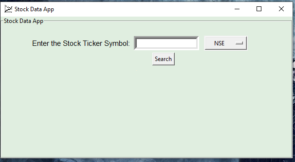
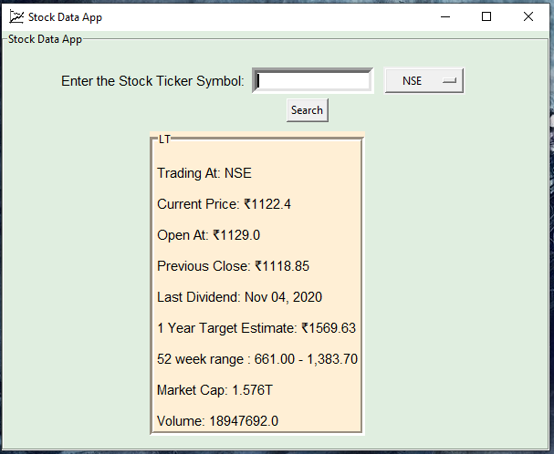
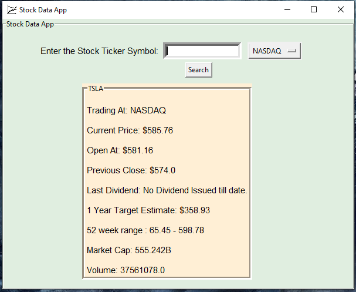

# Stock-Data-App
A GUI based application developed using Python and its Tkinter package which accepts stock ticker symbols as input and returns the following information related to the stock
1) The Stock Exchange its trading at
2) Its current market price
3) Its opening price
4) Its previous close
5) The date when the last dividend was issued
6) Its 1 year estimate
7) Its 52 week range
8) Its Market Cap
9) Its Volume

The App uses the yahoo_fin package for getting all the above information. There are two modules in the yahoo_fin package, stock_info and options. The App uses the stock_info module to get all the above information. It uses two functions get_live_price() to get the live price and get_quote_table() to get the rest of the information.

The App can get the above points of information regarding a stock from NASDAQ and NSE.

The Application at start up:-

The Application after getting stock data of Larsen and Toubro Limited from the NSE.

The Application after getting stock data of Tesla, Inc from the NASDAQ.

